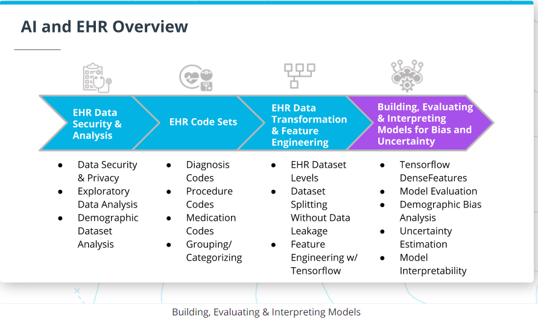

Learn the fundamental skills of working with EHR data in order to build and evaluate compliant, interpretable machine learning modoles that account for bias and uncertainty using  libraries and tools including Tensorflow Probability and GPU processing. Understand the implications of key data privacy and security standards in healthcare. Apply industry code sets, transform datasets at different EHR data levels, and use Tensorflow to engineer features.

